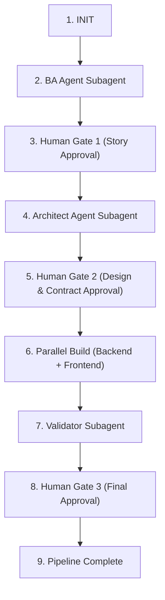

# Master Orchestrator Workflow

Invoke with `/agent-orchestrator` (e.g. "`/agent-orchestrator` run on PRD docs/prd/sample-auth.prd.md").

## How to delegate

Every stage below runs through the **`invoke_subagent`** tool, targeting a custom agent defined in `.agents/agents/`. All five have `subagent: true` and `mainAgent: false`, so they are delegation-only — never try to select one as the primary agent.

## How the gates work — read this before running

This pipeline has three **blocking** human review gates. There is no frontmatter or tool flag that forces a pause; a gate holds only because the step below says to stop and you actually wait for a typed reply.

Therefore, at every gate:

- **Do not** put `// turbo` on a gate step, or on any step after a gate that has not yet been approved.
- Post the gate summary, then **stop your turn**. Do not begin the next stage in the same turn.
- Resume only on an explicit approval from the user — the word `approve` or `proceed`. Silence, a thumbs-up, an unrelated question, or a comment left on an Artifact is **not** approval.
- If the user asks for changes, re-invoke the same subagent with their feedback and re-present the gate.

For a stronger guarantee, set your Artifact review policy to **Request Review** in Antigravity settings so plan and diff Artifacts also pause for explicit approval. That is a user-side setting — this workflow cannot set it for you.

---

## State Machine Sequence

---

### Step 1: Initialize Pipeline
1. Read `pipeline/state.json`.
2. Set `current_feature` to the PRD name.
3. Update `current_stage` to `BA_RUNNING`.
4. Save `pipeline/state.json`.

---

### Step 2: Run BA Agent
1. Inform user: "Spawning **BA Agent** subagent to analyze PRD..."
2. `invoke_subagent` → `ba-agent`
   - Prompt: "Decompose PRD at `docs/prd/<feature>.prd.md` into user stories under `docs/stories/<feature>/` and generate `docs/stories/<feature>/index.md`."
3. Upon completion, verify story files exist.
4. Update `pipeline/state.json`: `current_stage` = `GATE_1`.

---

### Step 3: Human Review Gate 1 (Stories) — BLOCKING
1. Read `docs/stories/<feature>/index.md`.
2. Present a summary: execution order, dependencies, blocking open questions, and PRD coverage.
3. Ask plainly: **"Approve these stories, or request changes?"**
4. **STOP. End your turn here.** Do not run Step 4 until the user replies with an explicit approval.
5. If changes are requested, re-invoke `ba-agent` with the feedback and return to sub-step 2.
6. On approval, move story files to `docs/feature_status/backlog/` and update `pipeline/state.json`: `current_stage` = `ARCH_RUNNING`.

---

### Step 4: Run Architect Agent
1. Inform user: "Spawning **Architect Agent** subagent to design architecture and contracts..."
2. `invoke_subagent` → `architect-agent`
   - Prompt: "Design technical ARD and API contract for approved stories in `docs/feature_status/backlog/`. Output to `docs/ard/` and `docs/contracts/`, and author contract-derived shared types and Zod schemas into `packages/shared/src/`."
3. Upon completion, verify ARD and contract files exist.
4. Update `pipeline/state.json`: `current_stage` = `GATE_2`.

---

### Step 5: Human Review Gate 2 (Architecture & Contract) — BLOCKING
1. Read the ARD and Contract.
2. Present a summary: architectural decisions, shared TypeScript types, API endpoints with their error tables, and Prisma schema changes.
3. Ask plainly: **"Approve and freeze this contract, or request a revision?"**
4. **STOP. End your turn here.** Do not run Step 6 until the user replies with an explicit approval.
5. If a revision is requested, re-invoke `architect-agent` with the feedback and return to sub-step 2.
6. On approval, mark the contract **immutable** — from this point `docs/contracts/`, `apps/api/prisma/schema.prisma`, and `packages/shared/src/` are frozen, and any change requires a new human-approved contract revision. Move stories to `docs/feature_status/in-dev/` and update `pipeline/state.json`: `current_stage` = `PARALLEL_BUILD`.

---

### Step 6: Parallel Build
1. Inform user: "Launching **Parallel Build** — Backend Agent and Frontend Agent executing concurrently..."
2. `invoke_subagent` twice, concurrently. Their write lanes are disjoint, so there is no file conflict:
   - `backend-agent` — implement DB migrations, services, controllers, routes, and unit tests within `apps/api/src/`, `apps/api/prisma/`, `apps/api/tests/unit/`.
   - `frontend-agent` — implement API client services, custom hooks, components, pages, and component tests within `apps/ui/src/` and `apps/ui/tests/components/`.
3. Wait for both subagents to complete. If either reports a contract gap, **do not let it improvise** — halt and escalate to the user for a contract revision.
4. Update `pipeline/state.json`: `current_stage` = `VALIDATION`.

---

### Step 7: Run Validator Agent
1. Inform user: "Spawning **Validator Agent** subagent to perform Security Audit, Code Review, and Integration Testing..."
2. `invoke_subagent` → `validator-agent`
   - Prompt: "Validate implementation changes against story acceptance criteria, ARD, and contract. Perform Security Audit, Code Review, and Integration Testing. Write integration tests to `apps/api/tests/integration/`."
3. Read `docs/reviews/<story-id>-validation-report.md`.
4. Update `pipeline/state.json`: `current_stage` = `GATE_3`.

---

### Step 8: Human Review Gate 3 (Final Validation & Merge) — BLOCKING
1. If the report outcome is `BLOCKED`:
   - Display the blocking issues to the user.
   - Re-invoke `backend-agent` / `frontend-agent` with the itemized failures assigned to each, then return to Step 7.
2. If the report outcome is `APPROVED`:
   - Present the final summary: security findings, contract adherence, AC coverage, and integration test results.
   - Ask plainly: **"Approve and complete, or send back for fixes?"**
   - **STOP. End your turn here.** Do not run Step 9 until the user replies with an explicit approval.
3. On approval, move stories to `docs/feature_status/completed/`.

---

### Step 9: Complete
1. Update `pipeline/state.json`: `current_stage` = `COMPLETED`.
2. Display the pipeline summary report to the user.
