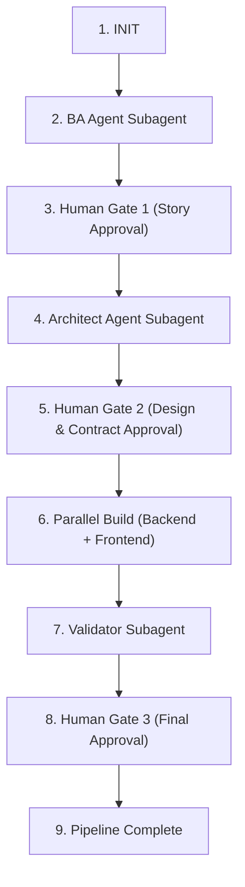

# Master Orchestrator Skill

## Overview

When the user invokes this skill (e.g. "run orchestrator on PRD docs/prd/sample-auth.prd.md"), follow this step-by-step state machine sequence to drive the pipeline.

**Spawning subagents:** use the `Agent` tool with `subagent_type` set to the target agent name (`ba-agent`, `architect-agent`, `backend-agent`, `frontend-agent`, `validator-agent`).

**Human review gates:** present the gate summary as text, then call **`AskUserQuestion`** to capture the decision. You must not advance the state machine past a gate on your own inference — only on an explicit user answer.

---

## State Machine Sequence

---

### Step 1: Initialize Pipeline
1. Read `pipeline/state.json`.
2. Set `current_feature` to the PRD name.
3. Update `current_stage` to `BA_RUNNING`.
4. Save `pipeline/state.json`.

---

### Step 2: Run BA Agent (Planner)
1. Inform user: "Spawning **BA Agent** subagent to analyze PRD..."
2. Spawn subagent via the `Agent` tool:
   - `subagent_type`: `ba-agent`
   - Prompt: "Decompose PRD at `docs/prd/<feature>.prd.md` into user stories under `docs/stories/<feature>/` and generate `docs/stories/<feature>/index.md`."
3. Upon completion, verify story files exist.
4. Update `pipeline/state.json`: `current_stage` = `GATE_1`.

---

### Step 3: Human Review Gate 1 (Stories)
1. Read `docs/stories/<feature>/index.md`.
2. Present a summary of the story index: execution order, dependencies, blocking open questions, and PRD coverage.
3. **STOP.** Call `AskUserQuestion` with options `Approve stories` / `Request changes`. Do not proceed on anything less than an explicit approval.
4. If changes are requested, re-spawn `ba-agent` with the user's feedback and return to step 2.
5. Upon approval, move story files to `docs/feature_status/backlog/` and update `pipeline/state.json`: `current_stage` = `ARCH_RUNNING`.

---

### Step 4: Run Architect Agent (Planner)
1. Inform user: "Spawning **Architect Agent** subagent to design architecture and contracts..."
2. Spawn subagent via the `Agent` tool:
   - `subagent_type`: `architect-agent`
   - Prompt: "Design technical ARD and API contract for approved stories in `docs/feature_status/backlog/`. Output to `docs/ard/` and `docs/contracts/`, and author contract-derived shared types and Zod schemas into `packages/shared/src/`."
3. Upon completion, verify ARD and contract files exist.
4. Update `pipeline/state.json`: `current_stage` = `GATE_2`.

---

### Step 5: Human Review Gate 2 (Architecture & Contract)
1. Read the ARD and Contract.
2. Present a summary of the architectural decisions, shared TypeScript types, API endpoints and their error tables, and the Prisma schema changes.
3. **STOP.** Call `AskUserQuestion` with options `Approve contract (freeze)` / `Request revision`. Do not proceed on anything less than an explicit approval.
4. If a revision is requested, re-spawn `architect-agent` with the user's feedback and return to step 2.
5. Upon approval, mark the contract **immutable** — from this point `docs/contracts/`, `apps/api/prisma/schema.prisma`, and `packages/shared/src/` are frozen and any change requires a new human-approved contract revision. Move stories to `docs/feature_status/in-dev/` and update `pipeline/state.json`: `current_stage` = `PARALLEL_BUILD`.

---

### Step 6: Parallel Build (Executors)
1. Inform user: "Launching **Parallel Build** — Backend Agent and Frontend Agent executing concurrently..."
2. Spawn both subagents **in a single message** (two `Agent` tool calls) so they run concurrently. Their write lanes are disjoint, so there is no file conflict:
   - `subagent_type`: `backend-agent` — implement DB migrations, services, controllers, routes, and unit tests within `apps/api/src/`, `apps/api/prisma/`, `apps/api/tests/unit/`.
   - `subagent_type`: `frontend-agent` — implement API client services, custom hooks, components, pages, and component tests within `apps/ui/src/` and `apps/ui/tests/components/`.
3. Wait for both subagents to complete. If either reports a contract gap, **do not let it improvise** — stop and escalate to the user for a contract revision.
4. Update `pipeline/state.json`: `current_stage` = `VALIDATION`.

---

### Step 7: Run Validator Agent (Quality Gate)
1. Inform user: "Spawning **Validator Agent** subagent to perform Security Audit, Code Review, and Integration Testing..."
2. Spawn subagent via the `Agent` tool:
   - `subagent_type`: `validator-agent`
   - Prompt: "Validate implementation changes against story acceptance criteria, ARD, and contract. Perform Security Audit, Code Review, and Integration Testing. Write integration tests to `apps/api/tests/integration/`."
3. Read `docs/reviews/<story-id>-validation-report.md`.
4. Update `pipeline/state.json`: `current_stage` = `GATE_3`.

---

### Step 8: Human Review Gate 3 (Final Validation & Merge)
1. If the Validator report outcome is `BLOCKED`:
   - Display the blocking issues to the user.
   - Re-spawn `backend-agent` / `frontend-agent` with the itemized failures assigned to them, then return to Step 7.
2. If the Validator report outcome is `APPROVED`:
   - Present the final validation summary: security findings, contract adherence, AC coverage, and integration test results.
   - **STOP.** Call `AskUserQuestion` with options `Approve and complete` / `Send back for fixes`. Do not proceed on anything less than an explicit approval.
3. Upon approval, move stories to `docs/feature_status/completed/`.
4. Update `pipeline/state.json`: `current_stage` = `COMPLETED`.
5. Display pipeline summary report to user.
