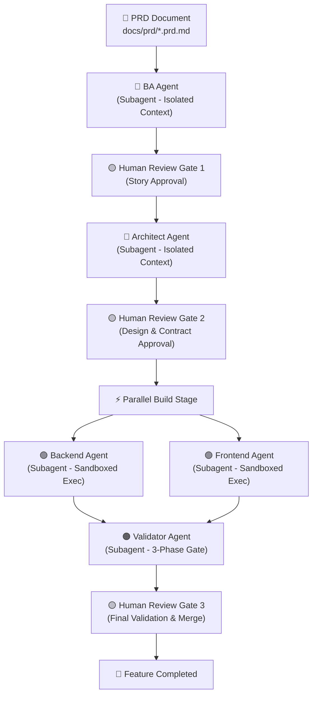

# Antigravity Agentic Build Pipeline

An enterprise-grade multi-agent build pipeline built entirely on **Google Antigravity primitives** (Native Subagents, Skills, Artifacts with feedback gates, and isolated context windows).

---

## 🏗️ Architecture: 3 Tiers × 5 Isolated Agents



---

## 📁 Directory Layout

```
agentic-pipeline/
├── .agents/
│   ├── AGENTS.md                   # Global pipeline rules & boundaries
│   ├── agents/                     # Subagent definitions (Isolated context, custom tools)
│   │   ├── ba-agent.md             # 🔵 Planner: BA Agent
│   │   ├── architect-agent.md      # 🔵 Planner: Architect Agent
│   │   ├── backend-agent.md        # 🟢 Executor: Backend Agent (Sandboxed)
│   │   ├── frontend-agent.md       # 🟢 Executor: Frontend Agent (Sandboxed)
│   │   └── validator-agent.md      # 🟠 Validator: Consolidated 3-Phase Gate
│   └── skills/
│       └── orchestrator/           # Orchestrator Skill
│           └── SKILL.md
├── docs/                           # Pipeline artifact directory (Agent I/O)
│   ├── prd/                        # Human PRDs (e.g. sample-auth.prd.md)
│   ├── stories/                    # User stories generated by BA Agent
│   ├── ard/                        # Technical design docs by Architect
│   ├── contracts/                  # API Contracts (Immutable post-Gate 2)
│   ├── reviews/                    # Validator reports
│   ├── retro/                      # Lessons learned
│   └── feature_status/             # Kanban state directories
├── pipeline/
│   └── state.json                  # State machine tracking file
└── src/                            # Project source code built by executors
```

---

## 🚀 How to Run the Pipeline

1. **Set Active Workspace**: Open `C:\Users\YSQUARE\.gemini\antigravity-ide\scratch\agentic-pipeline` in Antigravity.
2. **Start Orchestrator**: In the conversation chat, run:
   > "Run the orchestrator skill to build `docs/prd/sample-auth.prd.md`"
3. **Step Through Human Gates**:
   - **Gate 1**: Review generated stories in `docs/stories/sample-auth/index.md` → click **Proceed**.
   - **Gate 2**: Review ARD and API contract in `docs/contracts/` → click **Proceed**.
   - **Parallel Build**: Backend & Frontend subagents execute concurrently.
   - **Gate 3**: Review 3-Phase Validation Report (Security + Code Review + Integration Tests) → click **Proceed** to finalize!
