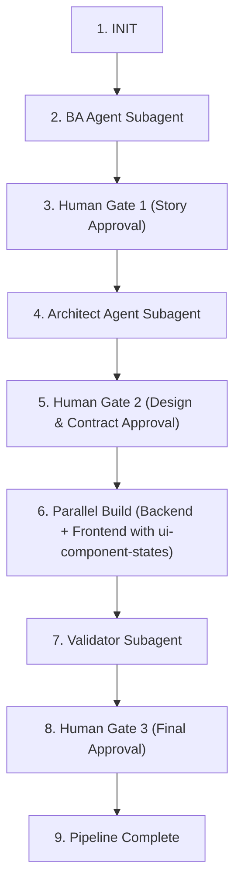

# Master Orchestrator Skill

## Overview

When the user invokes this skill (e.g. "run orchestrator on PRD docs/prd/sample-auth.prd.md"), follow this step-by-step state machine sequence to coordinate execution across subagents and domain skills.

---

## State Machine Sequence

---

### Step 1: Initialize Pipeline
1. Read `pipeline/state.json`.
2. Set `current_feature` to the PRD name.
3. Update `current_stage` to `BA_RUNNING`.
4. Save `pipeline/state.json`.

---

### Step 2: Run BA Agent (Planner)
1. Inform user: "Spawning **BA Agent** subagent to analyze PRD..."
2. Execute subagent:
   - Target Agent: `ba-agent`
   - Prompt: "Decompose PRD at `docs/prd/<feature>.prd.md` into user stories under `docs/stories/<feature>/` and generate `docs/stories/<feature>/index.md`."
3. Upon completion, verify story files exist.
4. Update `pipeline/state.json`: `current_stage` = `GATE_1`.

---

### Step 3: Human Review Gate 1 (Stories)
1. Read `docs/stories/<feature>/index.md`.
2. Present a feedback artifact summarizing the story index.
3. Set `RequestFeedback: true` on the artifact.
4. **STOP** and wait for human approval ("Proceed").
5. Upon user approval, move story files to `docs/feature_status/backlog/` and update `pipeline/state.json`: `current_stage` = `ARCH_RUNNING`.

---

### Step 4: Run Architect Agent (Planner)
1. Inform user: "Spawning **Architect Agent** subagent to design architecture and contracts..."
2. Execute subagent:
   - Target Agent: `architect-agent`
   - Prompt: "Design technical ARD and API contract for approved stories in `docs/feature_status/backlog/`. Output to `docs/ard/` and `docs/contracts/`."
3. Upon completion, verify ARD and contract files exist.
4. Update `pipeline/state.json`: `current_stage` = `GATE_2`.

---

### Step 5: Human Review Gate 2 (Architecture & Contract)
1. Read ARD and Contract summaries.
2. Present a feedback artifact summarizing system decisions, TypeScript types, and API endpoints.
3. Set `RequestFeedback: true` on the artifact.
4. **STOP** and wait for human approval ("Proceed").
5. Upon user approval, mark contract as **immutable**, move stories to `docs/feature_status/in-dev/`, and update `pipeline/state.json`: `current_stage` = `PARALLEL_BUILD`.

---

### Step 6: Parallel Build (Executors)
1. Inform user: "Launching **Parallel Build** — Backend Agent and Frontend Agent executing concurrently..."
2. Launch background subagent executions:
   - **Backend Agent** (`backend-agent`): Implement DB migrations, services, controllers, routes, and unit tests in `apps/api/`.
   - **Frontend Agent** (`frontend-agent`): Implement API services, custom hooks, components, pages, and component tests in `apps/ui/` adhering to the [ui-component-states](../ui-component-states/SKILL.md) skill.
3. Wait for both subagents to complete.
4. Update `pipeline/state.json`: `current_stage` = `VALIDATION`.

---

### Step 7: Run Validator Agent (Quality Gate)
1. Inform user: "Spawning **Validator Agent** subagent to perform Security Audit, Code Review, and Integration Testing..."
2. Execute subagent:
   - Target Agent: `validator-agent`
   - Prompt: "Validate implementation changes against story acceptance criteria, ARD, and contract. Perform Security Audit, Code Review, and Integration Testing."
3. Read `docs/reviews/<story-id>-validation-report.md`.
4. Update `pipeline/state.json`: `current_stage` = `GATE_3`.

---

### Step 8: Human Review Gate 3 (Final Validation & Merge)
1. If Validator report outcome is `BLOCKED`:
   - Display blocking issues to user.
   - Route fixes back to `backend-agent` / `frontend-agent`.
2. If Validator report outcome is `APPROVED`:
   - Present final validation summary artifact with `RequestFeedback: true`.
   - Wait for human approval ("Proceed").
3. Move stories to `docs/feature_status/completed/`.
4. Update `pipeline/state.json`: `current_stage` = `COMPLETED`.
5. Display pipeline summary report to user.
